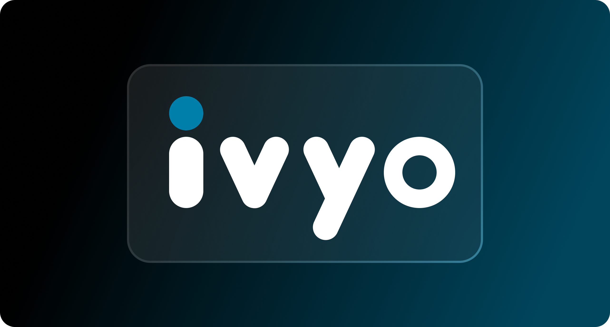

# 🧠 IVYO — AI-Powered Interviewer  
> Built different. Built for Gen Z.

Welcome to **IVYO**, the AI that grills you like a recruiter, vibes like a peer, and preps you like a pro. Whether it’s your first job or your fifth pivot, IVYO tailors interview questions based on **your resume** and the **job you’re gunning for**. No fluff. Just smart prep.

## 🔥 What IVYO Does
- 🔍 **Parses your resume** — Skills, roles, projects, it gets you.
- 🎯 **Reads the job description** — Understands what the employer actually wants.
- 🧠 **Asks curated questions** — Behavioral, technical, role-specific. Personalized.
- 📈 **Tracks performance** — See how you evolve across sessions.

## ⚙️ How It Works
1. Upload resume.
2. Paste job description.
3. Get roasted (constructively).
4. Repeat till you’re untouchable.

## ✨ Why IVYO Slaps
- GenAI at the core. No script. No repetition. No mercy.
- Trains you to **think on your feet** and **speak like a sniper**.
- Built for the attention-fragmented Gen Z mind. Fast. Sharp. No cringe.

## 🧩 Built With
- LLMs (for language & context)
- NLP pipelines (for resume + JD parsing)
- Scoring engines (for feedback)
- Vibe checks (for UX)

## 🖤 The Org Behind It
We’re not a startup, we’re a rebellion.  
IVYO is brought to life by a crew that believes **AI isn't replacing you — it's training you to dominate.**

## 🤝 Join Us
Coders, designers, weirdos — if you speak fluent chaos and precision, pull up.

---

> IVYO: Practice like you’re broke. Interview like you’re built for it.
